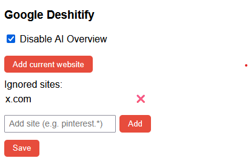

# Google Deshitify

**Google Deshitify** is a browser extension for Firefox and Chromium-based browsers that automatically removes the AI Overview (the annoying “Google AI answer” at the top of your search) and blocks results from sites you never want to see again.

- ⚡️ Instantly rewrites Google search URLs before the page loads—no flicker!
- 🧹 Default filter removes **pleno.news** (yes, do not qq about it) and lets you easily block other spammy/irrelevant sites (like pinterest, quora, etc).
- 🖱 Add any site to your blocklist with one click (“Add current website”).
- 🛡 Optionally disables only the AI Overview or runs with custom rules.
- 🖤 100% client-side, private, open source, and zero analytics.

---

## Features

- **Blocks Google AI Overview** with a simple toggle (default: on).
- **Persistent blacklist**: Add or remove any site, via table or one-click from the popup.
- **Works instantly**: Redirection happens before Google can even show the AI box or blocked sites.
- **No bloat, no trackers, no ads**.

---

## Installation

1. **[Download this repository as ZIP](https://github.com/seuusuario/google-deshitify/archive/refs/heads/main.zip)** or `git clone https://github.com/seuusuario/google-deshitify.git`
2. Open your browser's extensions/add-ons page:
   - **Firefox:** `about:debugging#/runtime/this-firefox` → "Load Temporary Add-on..." → select `manifest.json`
   - **Chrome/Chromium/Brave/Edge:** `chrome://extensions` → enable "Developer mode" → "Load unpacked" → select the folder.
3. Use Google as usual. Click the Deshitify icon to edit your blacklist or settings.

---

## Screenshots

---

## Advanced

- Add any site with "Add current website".
- You can block any domain, wildcard or not (e.g. `example.com`, `pinterest.*`, `subdomain.domain.com`).
- All options are saved locally and can be changed anytime from the popup.

---

## License

**Do what the fuck you want with this extension.**  
Really.  
If you want an official name, let's call it the MIT License:  
> Permission is hereby granted, free of charge, to any person obtaining a copy of this software and associated documentation files (the “Software”), to deal in the Software without restriction, including without limitation the rights to use, copy, modify, merge, publish, distribute, sublicense, and/or sell copies of the Software, and to permit persons to whom the Software is furnished to do so, subject to the following condition:  
>
> **Do not sue me if your Google stops working.**

---

## Credits

Developed by [Paulo Manrique](https://github.com/paulomanrique) and ChatGPT.  

---

**Enjoy your cleaner Google. Power to the searchers!**
